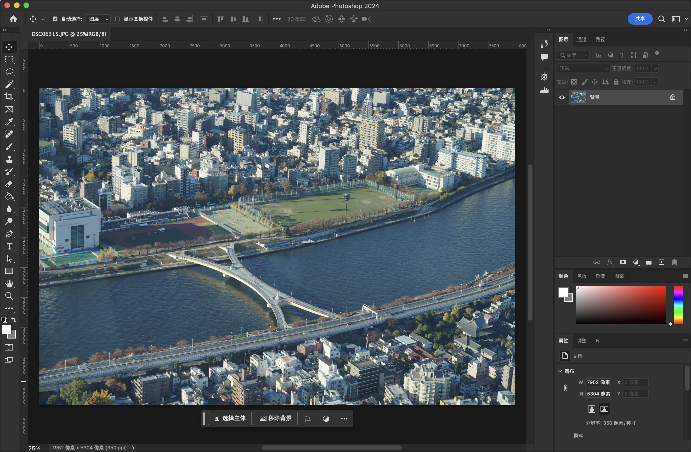
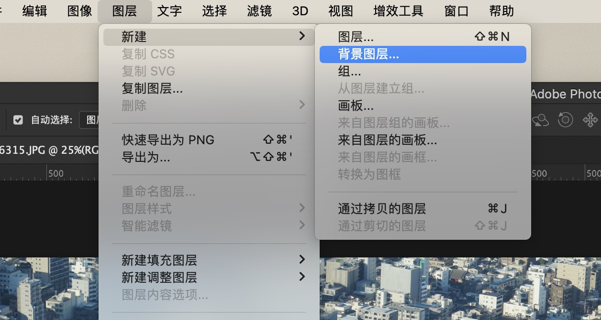
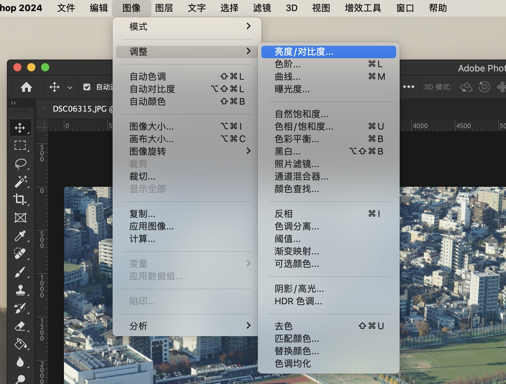
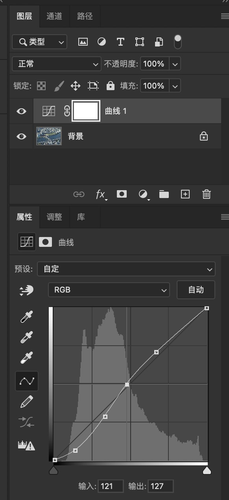
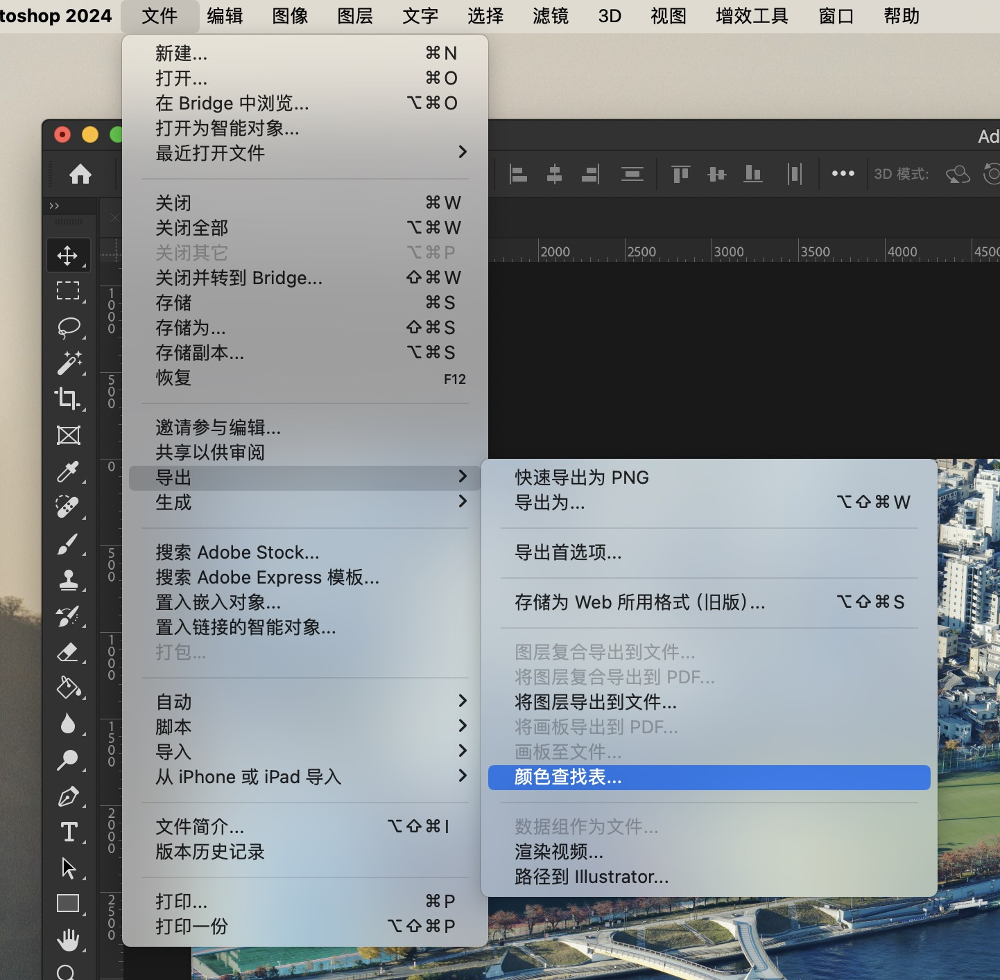
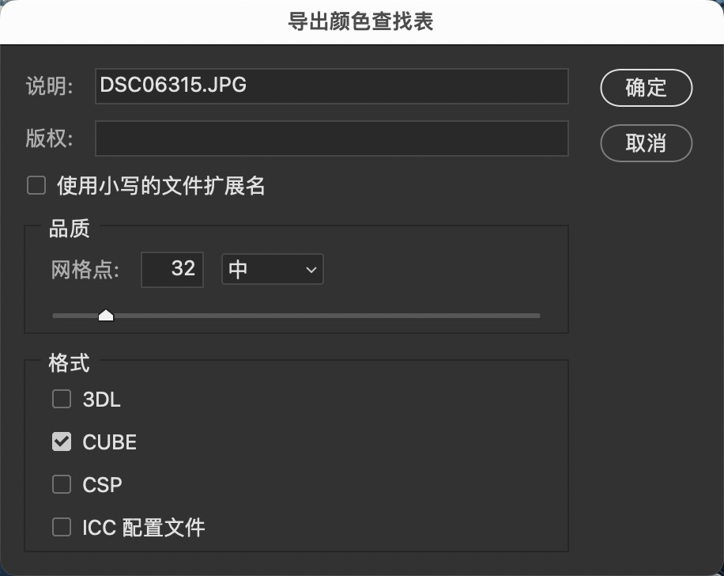
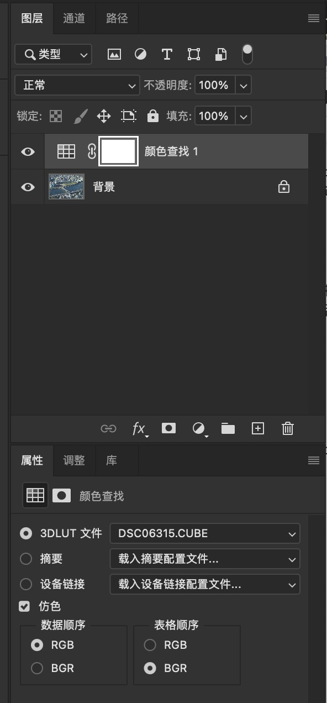
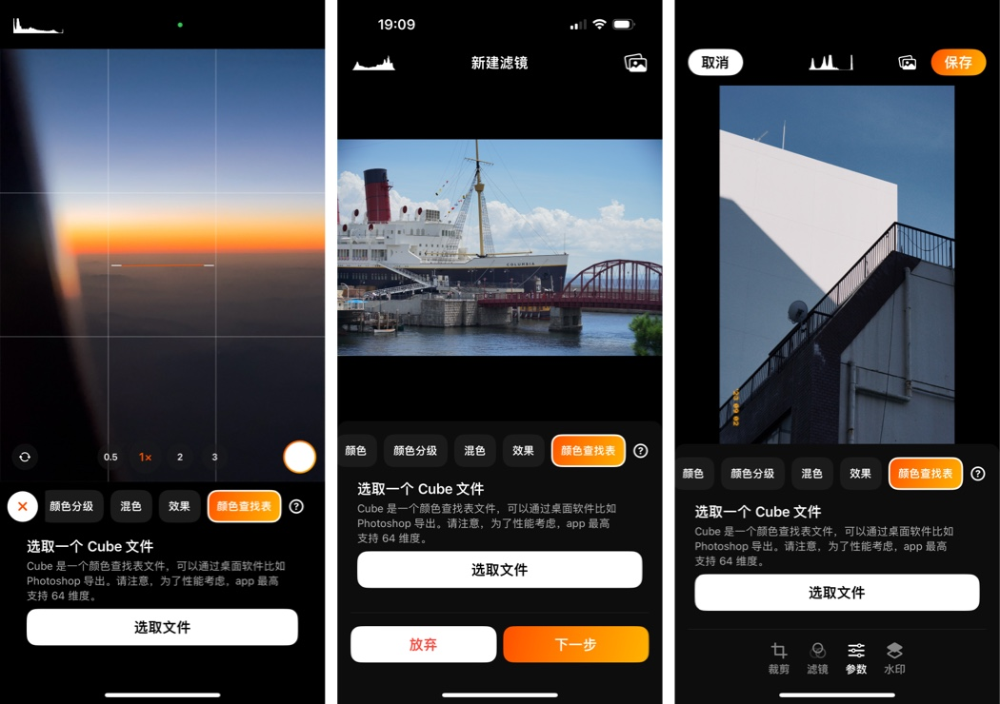

# 创建并使用 3D 颜色查找表

> Look Up Table (简称LUT，颜色查找表）是一种降低GPU运算量的技术，通过事先将颜色值存储在一张缓存表中当需要运算的时候直接从这张表中索引出对应的颜色值，本质上可看做计算机领域常见的存储空间换运算时间的算法应用，这项技术常用于图像调色领域。

PhotonCam 支持最高达 64 维的颜色查找表 Cube 文件。你可以在网上找到这些立方体文件，或者使用你的摄影后期技术自己创建。

要创建 Cube 文件，相对简单的方法是使用 Adobe Photoshop 软件。在 YouTube 或互联网上的其他地方有许多教程；当然，在下文我会介绍一些关于使用 Photoshop 导出 Cube 的基础教程。

通常，要创建并导出一个 Cube 文件，你需要：
1. 打开一张图像。
2. 使用图层调节工具编辑图像。
3. 将其导出为 Cube 文件。

要在 PhotonCam 中使用 Cube 文件，你应该：
1. 使用 AirDrop 等方式将 Cube 文件发送到你的 iPhone
2. 启动 PhotonCam
3. 在新建滤镜、照片编辑等页面，在工具栏顶部找到颜色查找表页面
4. 点击导入按钮，在 iOS 的「文件」app 中找到 Cube 文件
5. 在导入的时候，app 会检查此 Cube 是否有效；如果有效的话，你将会看到应用此 Lut 后的画面变化。

## 使用 Photoshop 导出 Cube

###  打开图像

首先，在 Photoshop 中打开一张图像。请确保图像是处于背景图层中。如果不是，请使用图层菜单中的「从图层创建背景」命令，从当前图像层创建一个背景层。

### 对图像进行调整

现在，你可以通过「图层」菜单的「调节」子菜单里的工具，新增各种调节图层，对原背景图层进行非破坏性编辑。

比如，你可以通过曲线调节工具，调节图像的亮度。

### 导出 Cube

要导出 Cube 文件，你需要通过文件菜单里的「导出」子菜单，点击导出为颜色查找表按钮。之后，你将会看到一个对话框。

在这里，你需要勾选 Cube 选项，并确保这里的 Grids Point 是少于或者等于 64。Grids Point 越大，app 需要处理的数据量就越大。通常来说，32 维度的 Cube 已经足够了。PhotonCam 的一部分自带滤镜是使用 Lut 来实现的，里面所使用的 Cube 是 32 维度的。

在导出 Cube 后，你可以通过 Photoshop 来检验此 Cube 是否有效。因为导出 Cube 的时候，不是你的所有调节都是能生效的——比如，如果你添加了一个颜色图形并通过设置混合模式来实现一些效果的话，你会发现导出的 Cube 并不包含这个效果。

### 检验导出的 Cube

你可以打开一张图像，并在图层菜单里，选择新建调整图层，然后选择颜色查找表来新建一个颜色查找表图层，之后你可以从右侧的面板里选择刚刚导出的 Cube 文件，然后在 Photoshop 里看你刚刚的调整是否有效。

### 在 PhotonCam 里导入 Cube

在使用 Photoshop 导出 Cube 后，你可以把它通过 AirDrop 的方式传送到 iPhone 上，然后使用 File app 保存到手机里。

在 PhotonCam 里可以通过多种方式来导入此 Cube 文件：
- 在拍照页面新建滤镜的时候
- 在滤镜管理页面新建或者编辑已有滤镜的时候
- 在照片编辑页面的「参数」页面

