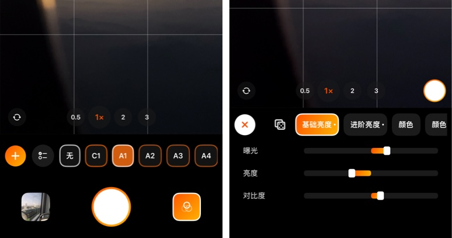
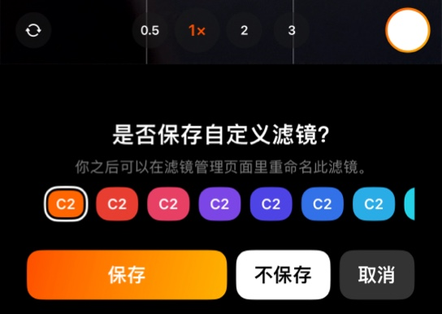
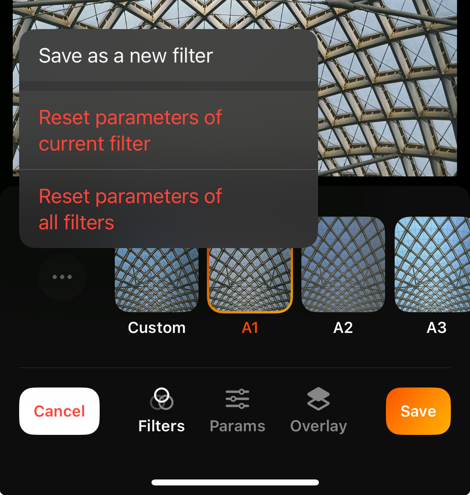
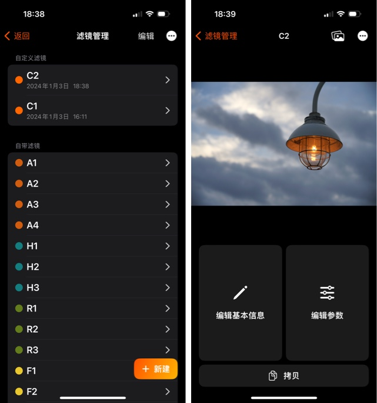
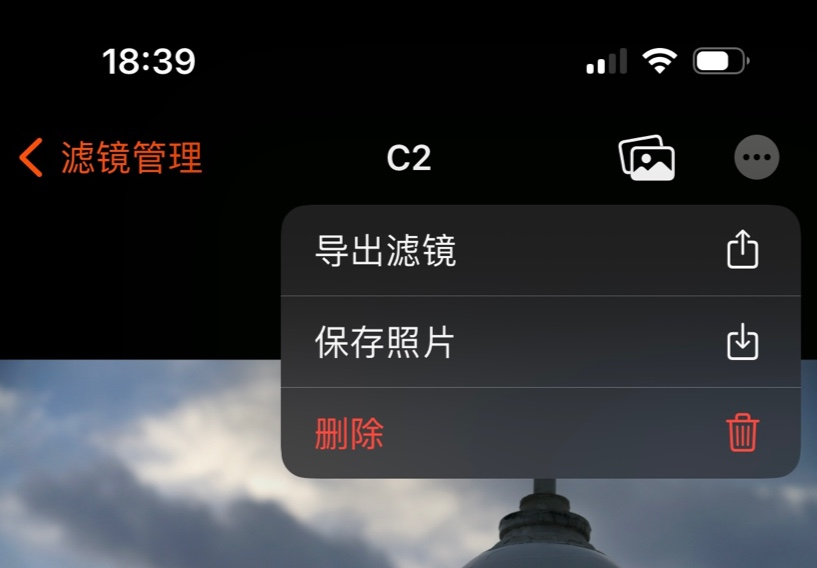

# 滤镜管理

除了提供自带滤镜外，你还可以使用 PhotonCam 来创造自己风格的效果，然后在拍摄或者编辑照片的时候使用这些自定义滤镜。

## 拍照的时候创造滤镜

在拍照界面里，点击右下方的滤镜按钮将唤起滤镜面板。在这里你可以点击使用所有的自定义滤镜和自带滤镜。要创造滤镜，请点击最左侧的 + 图标。

之后，将唤起编辑工具面板。在这里，你可以在使用手机取景的同时，去使用编辑工具里的亮度调节、进阶亮度调节、颜色分级、混色、效果调节和导入颜色查找表，然后实时预览效果。

在点击 × 按钮后，如果你对调节过参数，那么会问你是否保存为新的滤镜。在这里，你可以选择它的颜色标签，以方便你对照片进行归类管理。之后，你可以在滤镜管理页面里，去对这些滤镜进行更名以及其他操作。

## 在照片编辑页面创造滤镜

在图片编辑页面，你可以选择一个滤镜并调整其参数。如果你对这个新滤镜满意，可以点击滤镜选项卡中的“...”图标，然后选择“保存为新滤镜”。

此操作将基于你调整的参数创建一个新滤镜。

请注意，即使使用内置滤镜，你仍然可以调整其参数。

例如，你发现内置的 A1 滤镜适用于这张照片，但亮度有点低。那么你可以调整曝光参数，并将其保存为一个新的滤镜，命名为“调整亮度的 A1”。（重命名滤镜需要你前往滤镜管理页面。）

## 拷贝滤镜并编辑

在滤镜管理页面，你可以通过点击右下角的按钮来创建一个新的滤镜并开始编辑其参数。

要拷贝一个滤镜，你可以进入滤镜详情页面，并点击下方的「拷贝」按钮，这将添加一个新的滤镜，并复制其所有参数。之后你可以对新滤镜进行参数调节并保存。

> 你也可以拷贝 app 的自带滤镜并调整的参数。

## 分享或者备份滤镜

要备份一个滤镜，请转到滤镜详情页面，点击 ... 菜单然后点击「导出滤镜」，然后会出现分享表单。你可以选择保存在你的 iPhone 上、分享给你的朋友或者通过 AirDrop 发送到你的 Mac 或其他设备。

> 你也可以通过在滤镜管理页面点击分享按钮来导出所有滤镜。要导入滤镜，点击滤镜管理页面中的导入按钮并选择一个 zip 文件。
