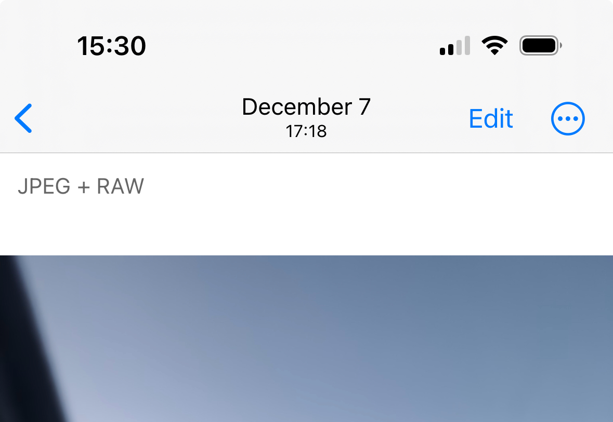
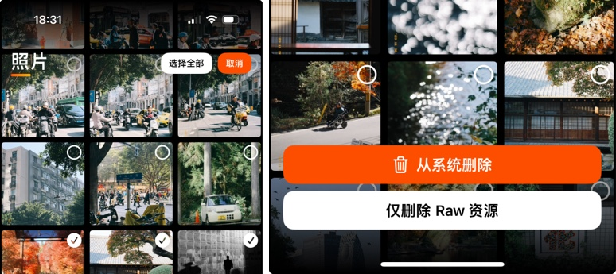

# Raw resources cleanup

## Photo resources model

PhotonCam 允许你使用 ProRaw 拍摄照片。当启用 ProRaw 拍摄照片时，两个文件将被保存在一个照片资产中（在 iOS 相册 app 里，一个列表里的照片对应一个照片资产，内部可能有一个或者多个照片文件）：

- 一个 HEIF 或 JPEG 文件作为主照片
- 一个 DNG 原始文件作为次照片

> 请注意，即使选择使用 HEIF 保存，在 iOS 相册里，它也只会显示 JPEG 标签。

在 PhotonCam 内编辑这种 HEIF + Raw 或者 JPEG + Raw 照片的时候，PhotonCam 会自动使用 Raw 照片来导入编辑。因此，你可以通过此方式，对照片进行「重编辑」，然后重新保存为新的 HEIF 或 JPEG 照片。

## 清理 Raw 文件

前面提到，你可以同时保存一个 HEIF/JPEG 和 Raw 文件到一个照片资产里，方便后期进行重编辑。当然，这种方式比较占用存储空间。如果你觉得已经没有必要保留 Raw 文件，那么 PhotonCam 可以帮助你在保留原 HEIF/JPEG 文件的情况下，去删除 Raw 文件。

你可以到 app 内的照片页面，点击右上角的选择按钮进行照片选择，选择需要清理的照片，然后点击最下方的「清理 Raw 文件」按钮。

当确认清理后，选中照片的 HEIF 和 JPEG 会重新创建并保存到相册，然后之后会弹出提示框询问是否删除旧的照片。

> 我的另一个 app MyerTidy 也有类似的功能，不过它提供更精细化的清理选项，并支持转换 4K 视频为 1080P，有兴趣欢迎去使用。