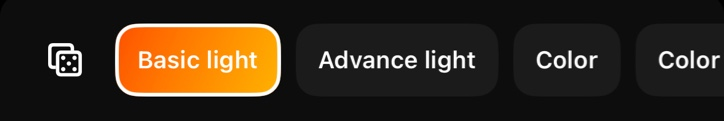
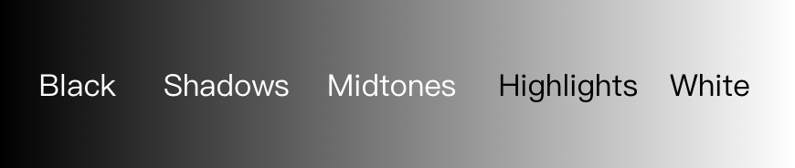
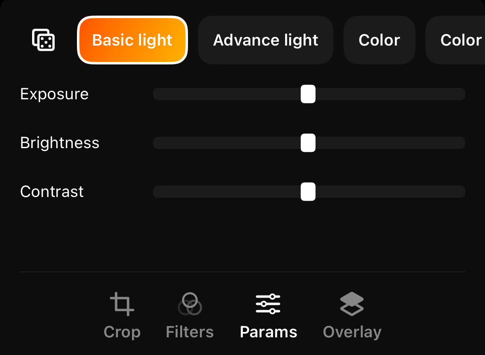
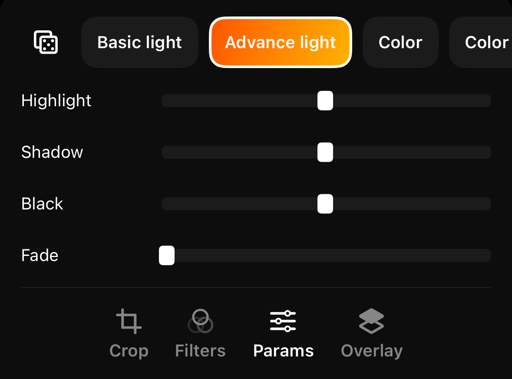
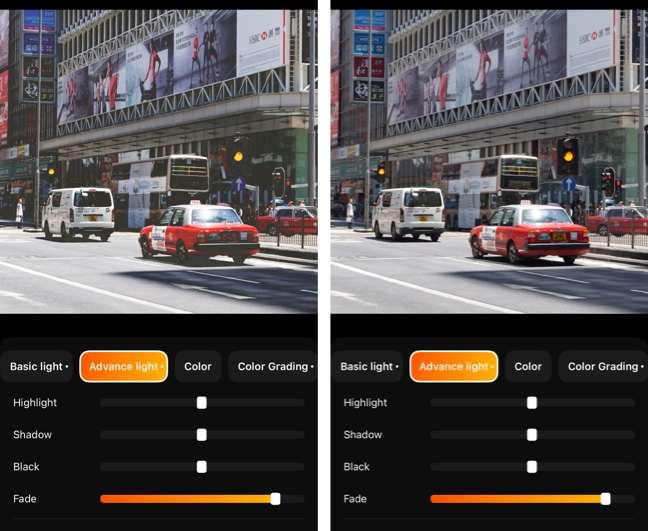
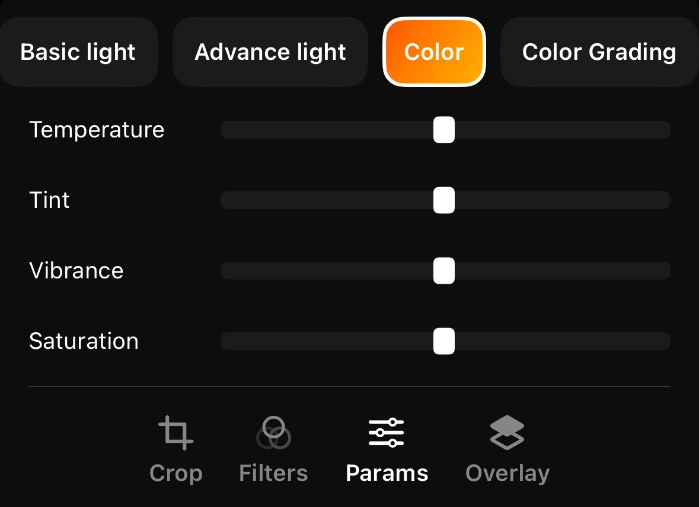
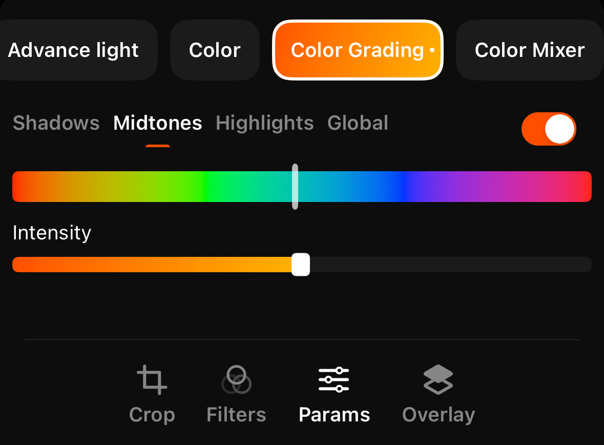
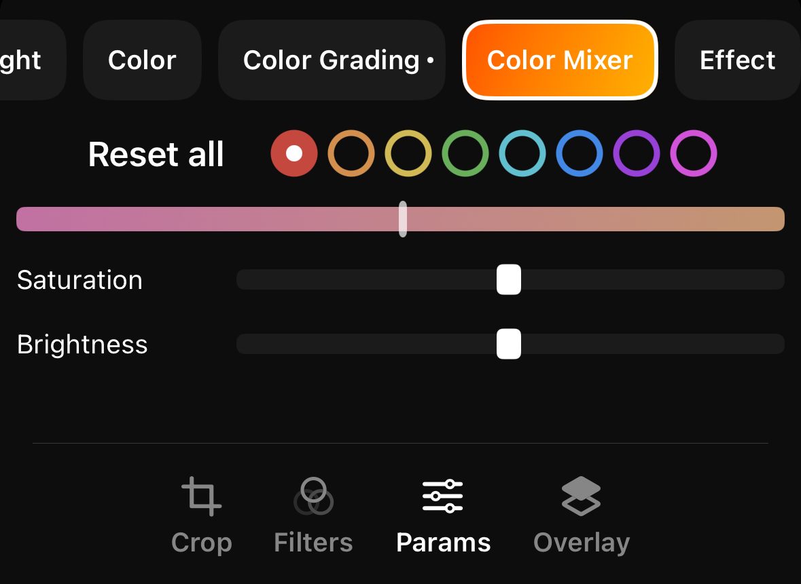
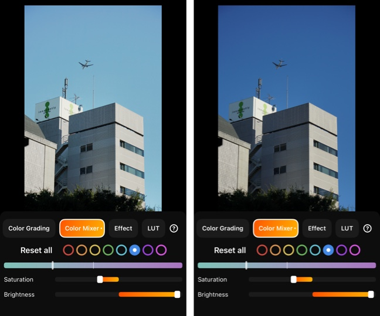
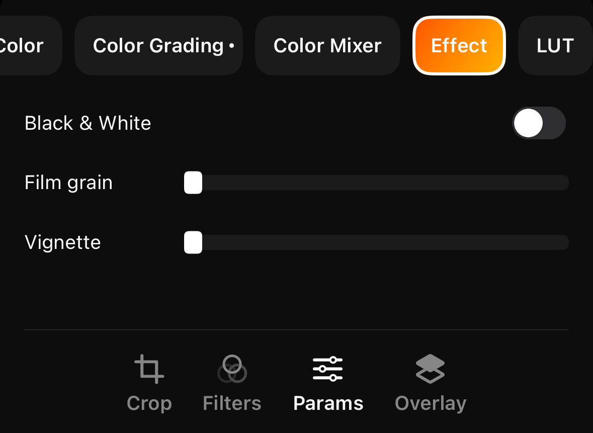

# Adjustment tools

PhotonCam includes some advance tools to help you create your perfect photos or filters.

If you are familiar with Adobe Camera Raw filter or Lightroom, you will find that the tools are similar. However, if you don't know much about them, you can follow this page and learn some basic techniques.

This page will list all the tools PhotonCam provides and specify how to use.

## Random filter

There is a die-like button on the left in the toolbar, which will help you create a random filter. If you are overwhelmed and can't figure out which style to use for your photos, you can try this on and on, and it may create a filter you like.

## Tonal range

Some tools introduced below allow you to adjust the image by different tonal range. Thus, it's important to get to know about the Tonal range. Tonal range refers to the levels between an image’s darkest and lightest points.

There are a few parts of the range:
- Black
- Shadows
- Midtones
- Highlights
- White

The image above shows each part of them. Note that the boundaries of these are not very clear. Adjusting one tonal range may affect the adjacent ones.

## Basic Light

In the basic light tab, you can adjust the photo by:
- Exposure
- Brightness
- Contrast

The exposure simulates the process of increasing/decreasing the Exposure compensation, which is like adjusting the EV value when capturing photos. It will affect all the pixels in any tones.

This brightness is a gentle version of exposure. It affects the shadows, midtones and highlights part of the image. While adjusting exposure may introduce over-exposure effect, adjusting brightness can avoid this issue.

By adjusting contrast, the highlights part of the photo will be lighter while the shadows part will be darker. This is equivalent to the "S" shape in curve.

## Advance light

In the advance light tab, you can adjust the brightness of the photo by tonal range of black, shadows, highlights and white. Those tools are helpful if you would like to fine-tune the brightness of your photo. For example, you can create your own version of "contrast" by adding highlights and lowering shadows.

There is one more tool to mention: fade. By increasing fade, the pure black part of the photo will become more gray, like some films effect. Combing this fade effect with Color grading with shadow, you can create the film-like effect, like this below.

The before and after comparison for fading adjustment is shown above, with the left side being the adjusted fading.

## Color

You can adjust the temperature, tint, vibrance and saturation of the photo in the color tab.

The main difference between vibrance and saturation is that saturation adjusts the intensity of all colors in the image equally and vibrance will do the same but avoid increasing the color intensity of the most saturated areas, avoid decreasing the intensity of the least saturated areas, and protect the skin tones in your image.

## Color grading

Aside from adjusting the lights and contrast of your photo, you can add colors to a specified tonal range, which is also a great tool to create a film-look effect.

For example, by adding green color to the shadow part, you will see the shadow area of your photo will be tinted with green color. You can choose the intensity of the color to be applied and select the color to be added using the color hue slider.

> Note that please remember to switch the toggle on to make it take effect.

## Color mixer

You can tweak the hue, saturation and the brightness of individual colors in color mixer tab.

For example, you can make the blue sky a bit more cyan by shifting the blue hue color to the left, like the image below.

## Effect

In the effect tab, you can choose to desaturate the whole image and make it black-white. Also, by adding film grain you can get a photo with noise effect. The vignette effect is an artistic darkening of a photo's corners compared to its center.

Combining those effects you may create a vintage style photo.

## Lut

Applying Lookup table effect requires more knowledge of photography, and there is a dedicated tutorial about that. Please refer to [this page](./Luts.md).