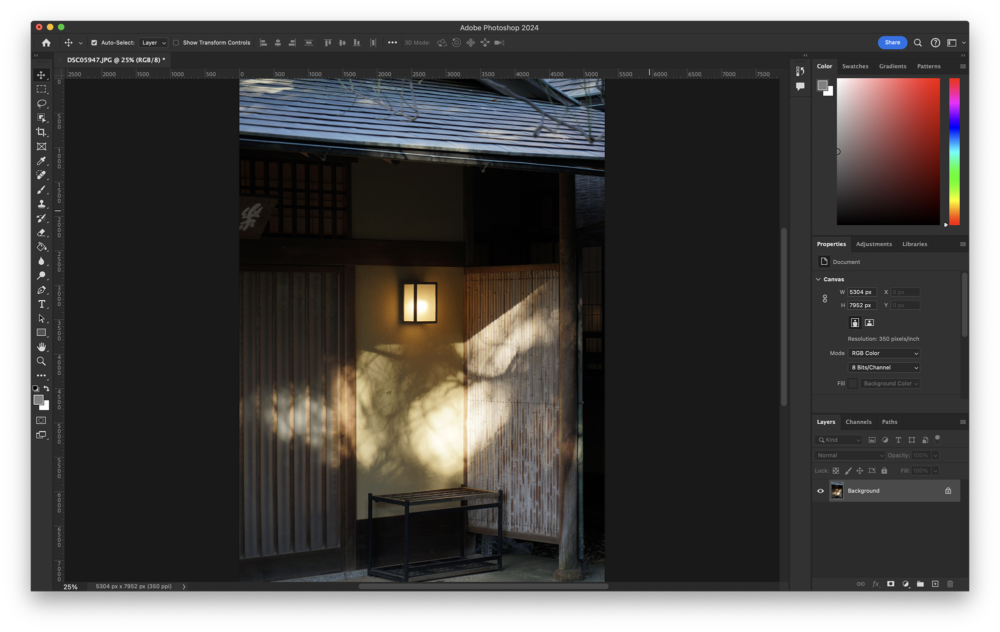
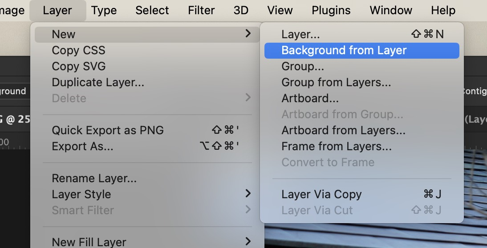
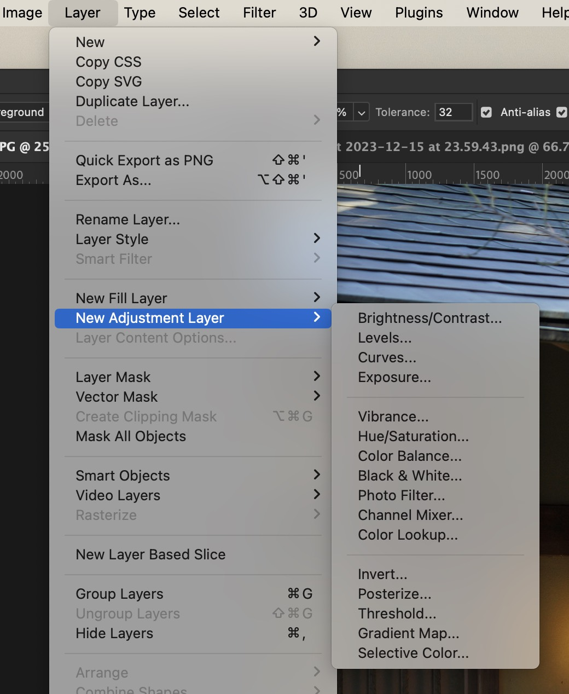
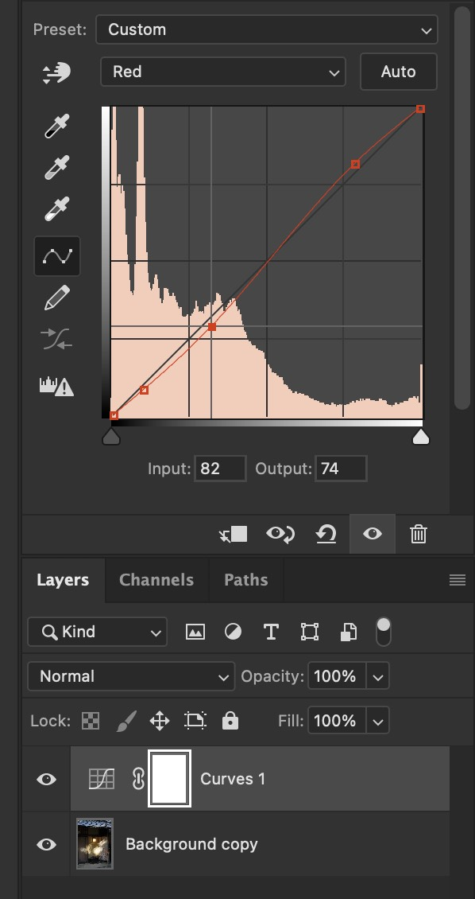
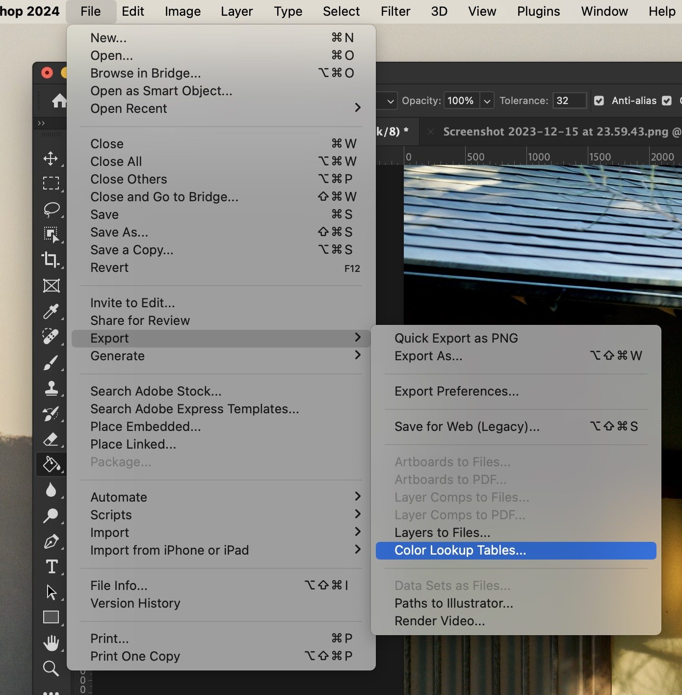
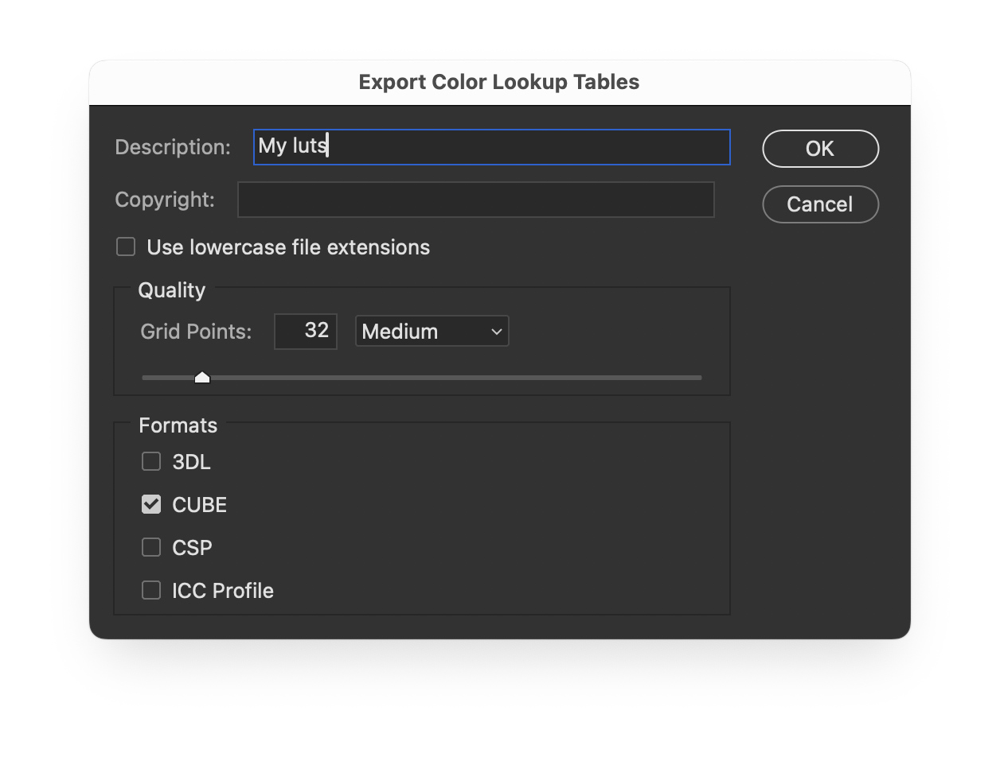
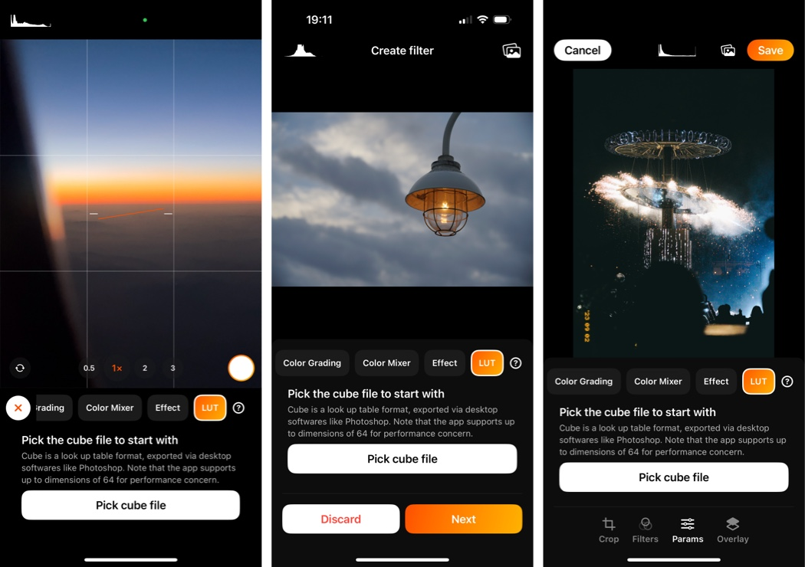

# About 3D LUTs

> In the film and graphics industries, 3D lookup tables (3D LUTs) are used for color grading and for mapping one color space to another. They are commonly used to calculate preview colors for a monitor or digital projector of how an image will be reproduced on another display device, typically the final digitally projected image or release print of a movie.

PhotonCam supports Lookup Table cubes with up to 64 dimensions. You can find those cube files online or create your own using the techniques you already know.

The relatively easy way to create a cube file is by using Adobe Photoshop. There are many tutorials on YouTube or other places on the internet; however, I will still introduce some basic procedures to implement that.

In general, to create a cube file, you should:
1. Open an image.
2. Use property tools to edit image.
3. Export it as cube file.

To use the cube in PhotonCam, you should:
1. Send the cube file into your iPhone, like via AirDrop.
2. Launch PhotonCam.
3. In the image edit page, select the "parameters" tab and find the "Lut" tab on the top of toolbar.
4. Click the import button and find the cube file in Files app.
5. If the cube file is valid, you should see the result in your image.

PhotonCam allows you to create your own filters while in the photo capturing page. The procedure is similar.

## Create cube using Photoshop

### Open an image

First, open an image in Photoshop. Please make sure the image is in the background layer. If not so, use the "Background from layer" command from the Layer menu to create a background layer from current image layer.

### Color-grade the image

Now you can perform some color grading to your image by using adjustments layer from the Layer menu. 

For example, adjusting the tones using the Curves tool.

### Export the cube

You can use the export menu to export Color Lookup Table.

As you select the command, a prompt dialog will be displayed asking you to fill out some information.

The important thing here is to check the "cube" box and make sure the grids points is not greater than 64. By default, the grids points are 32, which is fine. The larger grids points are, the more intense will the computation be. To use the cube in your iPhone, you should keep this as low as possible. I have tested it and 32 will be fine.

Then you will be asked to save the cube file in your disk.

Before sending this cube to your iPhone, you are suggested to validate the cube using the Photoshop.

### Validate the cube

You can use `Layer -> New Adjustment layer -> Color Lookup` tool to import the exported cube from your disk and check if the result is as expected.

### Use cube in PhotonCam

After exporting the cube file, you can send it to your iPhone via AirDrop and save it in the Files app.

There are various places you can use this cube file.

- Go to the filter management page and create or edit a filter.
- Tap the "+" icon in the camera preview page to create a new filter.
- Go the photo album in app and import an image to edit.

By clicking the pick button, the file picker will be displayed, and you can locate your cube file and import it in app and see the result.

