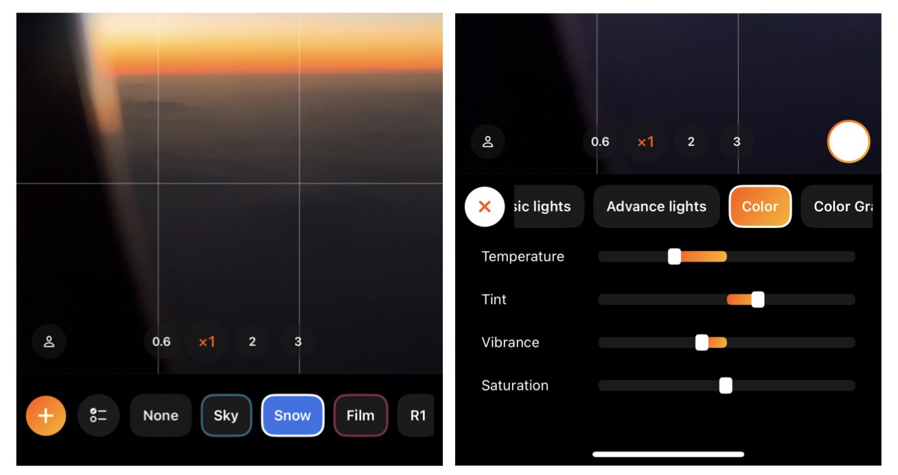
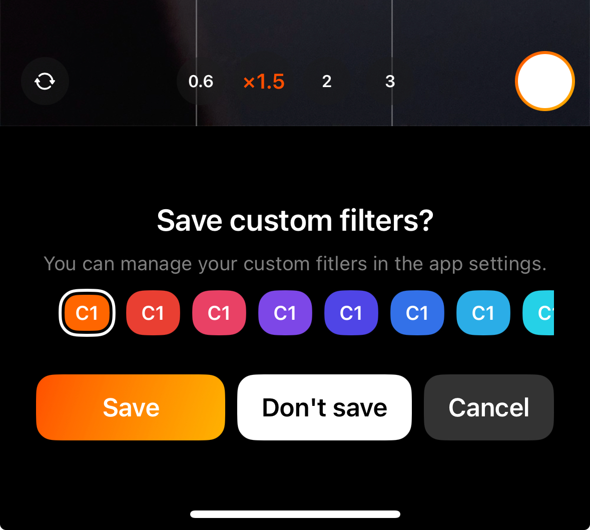
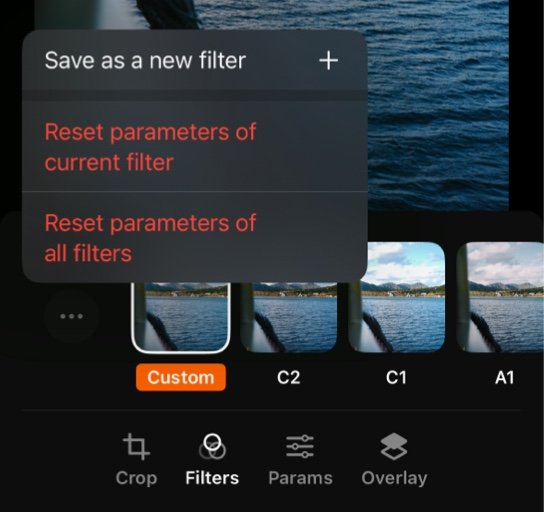
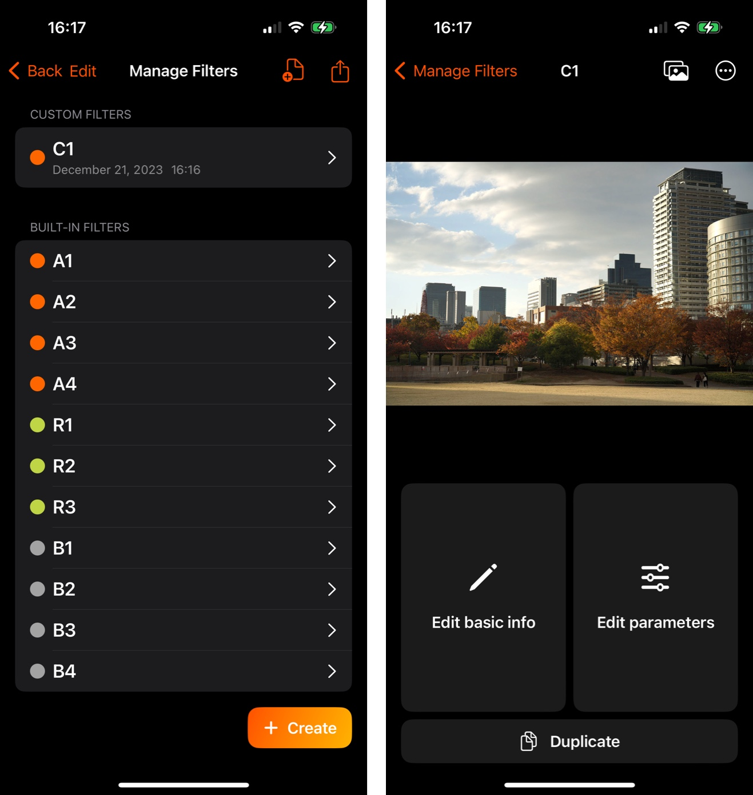
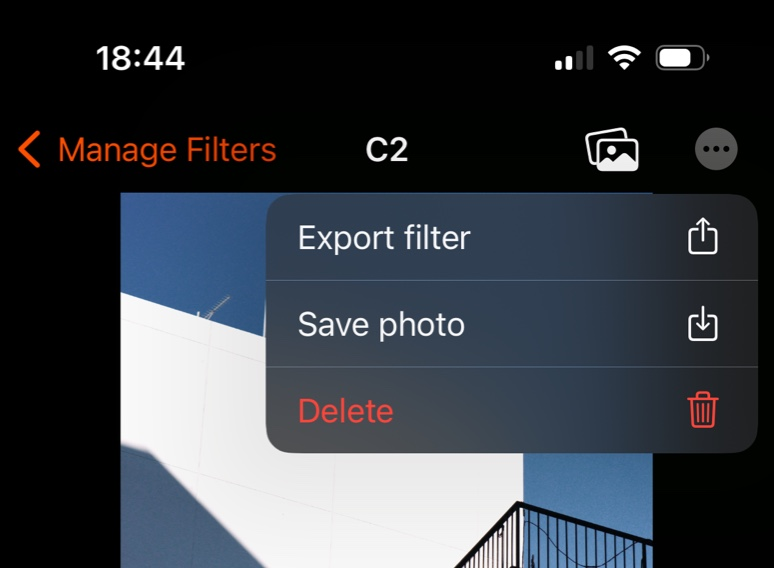

# Manage filters

Aside from using the built-in filters, PhotonCam allows you to create your own filters while in capturing photos or in editing photos.

## Create your filter when capturing

When you open the filter panel by clicking the right-bottom icon, not only you can choose which filter to be applied, you can also click the "+" icon on the left to start a filter creation.

You can then adjust the parameters and the preview will update in real time to reflect your changes.

By clicking the "×" button, a prompt will be shown to let you choose to save this as a new filter or not. You can choose a preferred color to mark this filter. 

However, you can only edit the filter name in the filer management page.

## Create your filter in image edit

In image edit page, you can select a filter to use and tweak its parameters. If you are satisfied with this new filter, you can tap the "..." icon in the Filters tab and choose "Save as a new filter".

This operation will create a new filter based on the parameters you tweak.

Note that even using the built-in filters, you can still tweak the parameters of it. 

For example, you find that the built-in A1 filter is good for this photo, but the exposure is a bit low. Then you can tweak the exposure parameter and save it as a new filter, named "A1 with Exposure tweaked". (Note that renaming filters requires you to go the filter management page.)

## Duplicate a filter to edit

In the filter management page, you can create a new filter and starting editing its parameter by clicking the bottom-right button. 

To duplicate a filter, you can enter the filter detail page, and click the "Duplicate" button below, which will add a new filter, copying all of its parameters. Then you can tweak its parameters.

> Note that you can also duplicate the built-in filters and tweak more parameters of them. Some built-in filters use external LUT and some of them use built-in color grading tools.

## Export filters to share or backup

To back up a filter, go to the filter detail page, click the "..." menu and click "Export parameters".

A share sheet will be displayed, you can choose to save it on your iPhone or share it to your friends or airdrop it to your Mac.

> You can also export all filters by clicking the share button in the filter management page.

To import the filter, click the import button in the filter management page and choose a zip file to start. 