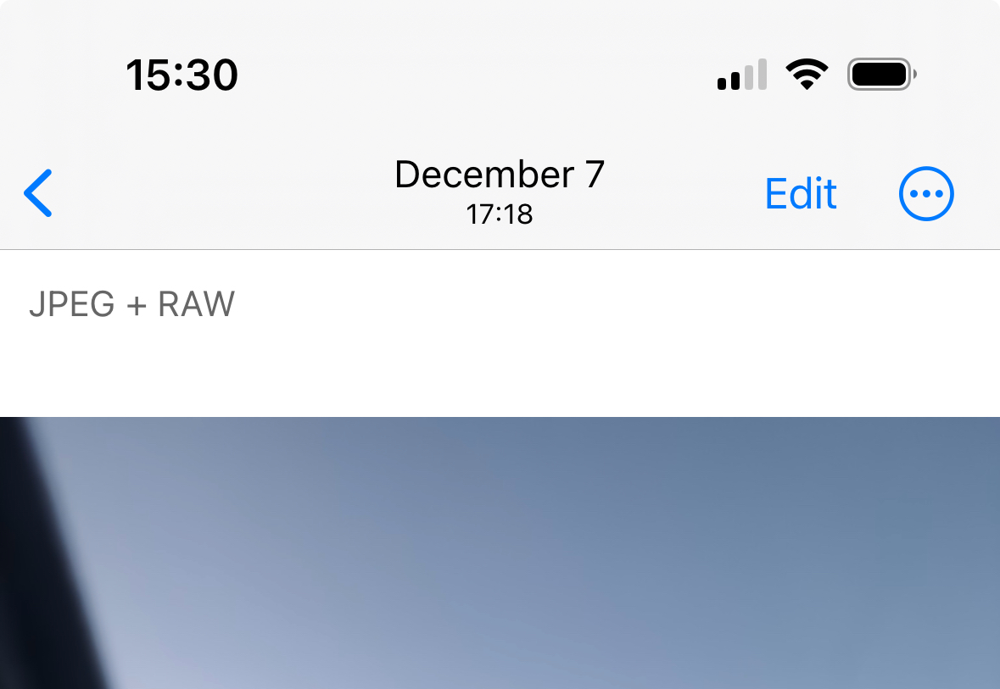
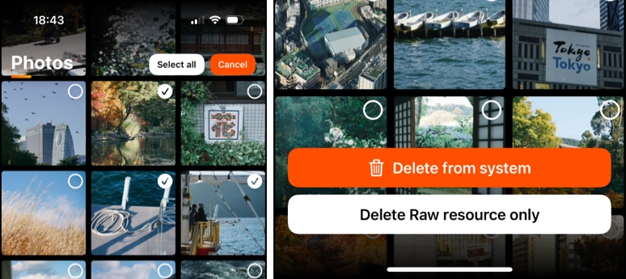

# Raw resources cleanup

## Photo resources model

PhotonCam allows you to capture photos with ProRaw. When you capture a photo with it enabled, two files will be saved in one photo asset:
- A HEIF or JPEG file as the primary photo
- A DNG raw file as the secondary photo.

> Note that iOS will only show "JPEG" tag even it's a HEIF. 

When editing this kind of photo in PhotonCam, it will automatically choose the RAW file to edit. So you will be able to have a second thought of the style of your photos.

## Clean up Raw files

PhotonCam can help you clean up raw files only if you would like to keep the HEIF/JPEG file and delete the DNG file.

You can go to the gallery page, click the top-right button and choose "Select".

When in this selection mode, you can select photos to delete the entire photo, including the HEIF/JPEG and the DNG files, or to delete the DNG file only.

When you choose to delete the DNG file only, new photos will be created, and you will be asked to delete the old ones.

> Note that my another app MyerTidy has the similar feature to convert DNG to HEIF/JPEG photos. It supports photos captured from all the other apps and allows you to specify the date range.